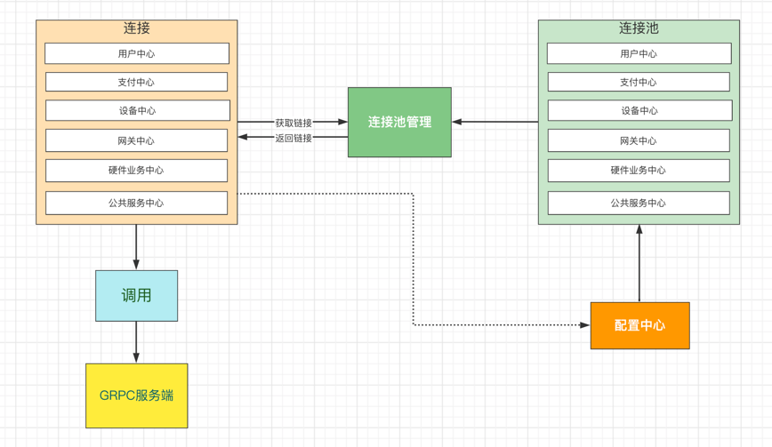
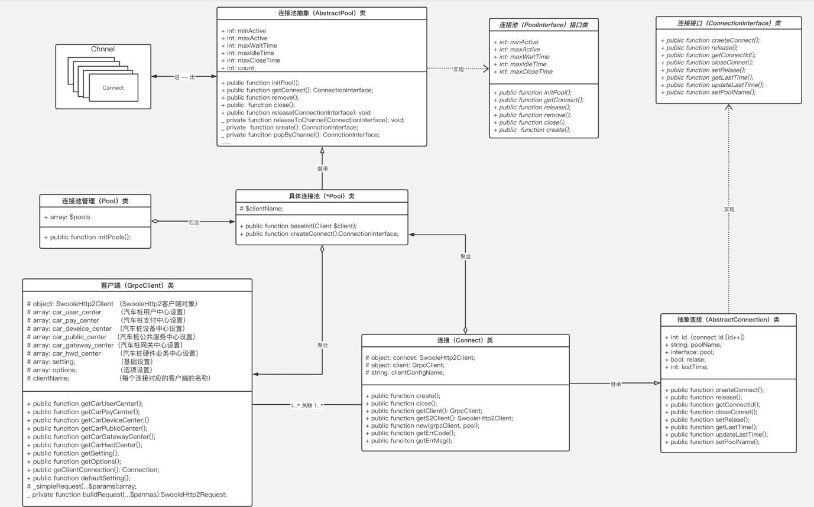

## swoft grpc client 端

### 1. 下载组件
````
composer下载：composer require hzwz-client/grpc-client dev-master
````

### 2. Bean.php里配置
```text
'grpcClients'      => [
        'car_user_center' => [  //用户中心
            'host'    => '127.0.0.1',         
            'port'    => 9903,              
            'setting' => [  //swooleHtt2Client设置
                'timeout'    => 10.0,      //超时时间，默认为10秒
                'ssl'        => false,     //是否开启ssl验证，如果不设置默认为false不开启
                'ssl_host_name' => '',  //是否使用ssl_host_name域名：如果不设置默认不使用
            ],
            'options' => [  //连接池的配置
                'minActive'       => 5,   //最小连接数，如果不设置默认5个
                'maxActive'       => 10,  //最大连接数，如果不设置默认10个
                'maxWait'         => 0,   //最大等待连接数，如果为0表示没有限制，如果不设置默认为0
                'maxWaitTime'     => 0,   //最大等待时间(秒)，如果为0表示没有限制，如果不设置默认为0
                'maxIdleTime'     => 60,  //每个连接的最大空闲时间，如果不设置默认60秒
                '$maxCloseTime'   => 3,   //关闭每个连接时的最大等待时间，如果不设置默认3秒
            ]
        ],
        //...

        'setting' => [  //swooleHtt2Client相关设置（当客户端没有进行setting配置时，默认使用这个设置）
            'timeout'         => 10,
            'ssl'             => false,
            'ssl_host_name'   => '',
        ],
        'options' => [ //连接池的配置（当客户端没有设置options的值时，默认使用这个配置）
            'minActive'       => 10,
            'maxActive'       => 50,
        ]
    ],
```
- 如果需要配置多个客户端（比如需要同时配置用户中心、支付中心、设备中心、公共服务中心等），按着上面实例配置即可。


### 3. 文件相关配置
```text
1. 在项目的App目录下创建一个gRPC目录
2. 然后在gRPC目录下创建一个Client目录。实例如下：
Grpc
├── Client
│   ├── CarDeviceCenterClient.php
│   ├── CarPayCenterClient.php
│   └── CarUserCenterClient.php
└── Service
    ├── CompanyServer.php
    ├── TestService.php
    └── UserService.php

3. 然后在该目录下创建对应需要调用的服务端的接口类（Client名称可以随意，这里只是做一个实例说明）。
```

### 4. gRpcClient的gRpc接口调用相关

- 通过protoc工具生成的 **Client相关类默认继承的是gRPC自带的继承类，需要替换成:[Hzwz\Grpc\Client\Client] 这个类
- 每个 **Client类里的 __construct($hostname, $opts, $channel = null)方法里面的值替换为：Grpc\Client\**Client类名。实例如下：
````php

class CarUserCenterClient
{
    /**
     * 通过设备组ID获取对应合伙人信息
     *
     * @return void
     */
    public function getGroupIdsFromShare(array $ids)
    {
        //这个信息是通过protobuf生成的类
        $request = new AgentsRequest();
        $request->setNickname($nickname); //参数设置
        $request->setIds($ids);           //参数设置

        //todo 这里传递当前的类名（__CLASS__）。
        $agentClient = new AgentsClient(__CLASS__);
        
        //开始调用。$res返回的是通过protobuf生成的响应类，$state为grpc的响应状态，$httpsRes为Swoole\Http2\Response响应类，如果不需要可以忽略
        [$res, $state, $http2Res] = $agentClient->getGroupIdsFromShare($request);
        vdump("test2结果", $res);
    }
}
````
- 备注：在编写 *.proto文件时，如果某个字段的类型定义的是为 [repeated]类型时，那么这个字段类型就是为数组类型。服务端在返回结果时，也有包含这个类型的话，那实际返回是一个[RepeatedField]类。需要通过 foreach()来处理下（这个是gRpc统一返回的，这个类实现了php的迭代器）。
- 实例如下：
  
````php
<?php
class CarUserCenterClient
{
    /**
     * 通过设备组ID获取对应合伙人信息
     *
     * @return array
     */
    public function getGroupIdsFromShare(array $ids): array()
    {
        //...省略
        
        //开始调用
        [$res, $state, $http2Res] = $agentClient->getGroupIdsFromShare($request);
       
       //请看这里
        $resData = array();
        if ($res->getMessage() instanceof RepeatedField) {
            $resultData = array();
            foreach ($res->getMessage() as $value) {
                $resultData[] = $value;
            }
        }

        $resData['data'] = $resultData;
        return $resData;
    }
}
````

### 5. 修改默认的gRpc继承类
代码实例：
````php
<?php
// GENERATED CODE -- DO NOT EDIT!

namespace Brother;

use Hzwz\Grpc\Client\Client as GrpcBaseClient;

class AgentsClient extends \Grpc\BaseStub
{
    public function __construct($className)
    {
        parent::__construct($className);
    }

    /**
     * @param \Brother\AgentsRequest $argument input argument
     * @param array $metadata metadata
     * @param array $options call options
     * @return \Brother\AgentResponse
     */
    public function initProfitPersonInfo(\Brother\AgentsRequest $argument,
      $metadata = [], $options = []) {
        return $this->_simpleRequest('/Brother.Agents/initProfitPersonInfo',
        $argument,
        ['\Brother\AgentResponse', 'decode'],
        $metadata, $options);
    }
}
````
- 上面的 *.Client类就是通过protoc工具生成的。默认继承的\Grpc\BaseStub。需要把\Grpc\BaseStub换成 [Hzwz\Grpc\Client\Client]。 
- 替换后的代码：
````php
<?php

use Hzwz\Grpc\Client\Client as GrpcBaseClient;

class AgentsClient extends GrpcBaseClient
{
    public function __construct($className)
    {
        parent::__construct($className);
    }

    /**
     * @param \Brother\AgentsRequest $argument input argument
     * @param array $metadata metadata
     * @param array $options call options
     * @return \Brother\AgentResponse
     */
    public function initProfitPersonInfo(\Brother\AgentsRequest $argument,
      $metadata = [], $options = []) {
        return $this->_simpleRequest('/Brother.Agents/initProfitPersonInfo',
        $argument,
        ['\Brother\AgentResponse', 'decode'],
        $metadata, $options);
    }
}
````
- 最后把__construct()方法里的参数换成第 [4]点里的说的类名（$className）。

### 关于每个接口里带的 $metadata 和 $options 两个形参。
  - 如果需要为某些接口设置自定义的参数可以设置在$metadata和$options里。
  - 比如 header 头的设置、接口连接重试次数和重试时间设置，可以设置到$options里。
  - 如果重试次数和每次重试时间没有设置的话，默认重试次数是 3 次。默认重试时间是 100毫秒。
  - 重试机制大概是：
      - 第一次睡眠 100毫秒。 然后进行 [补偿时间间隔] 处理后得到下一次的一个范围内的随机睡眠时间
      - 然后接着进行第二次的请求
      - 第三次过程和上述过程一样 （这里的重试次数如果走默认的话就是三次。可以根据需要自定义）。
  - $options里的重试次数和重试时间的两个字段为：
     - retry_num       重试次数
     - retry_sleep     重试时间
- 一个简单的配置例子：
```php
<?php

   /**
     * 通过名称获取运营商信息
     * @param $nickname
     */
    public function getCompositeUserInfo($nickname)
    {
        //...
        [$res, $state, $http2Res] = $client->getCompositeUserInfo(
          $request,
          [] //metadata setting
          ['retry_num' => 2, 'retry_sleep' => 200] //$options setting
        );
        //...
    }
```

### 基本流程图


### UML图
